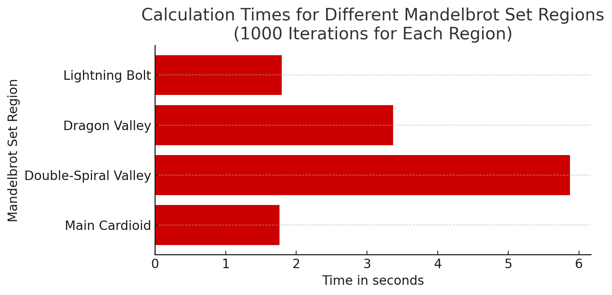

# Parallel Painting
#### A Mandelbrot Set Parallelization Project

## Overview
Implement a parallel version of the Mandelbrot set using OpenMP, explore the performance implications of different OpenMP features and settings, and conduct a scaling study to understand the performance benefits of parallel execution.

**Background:** The [Mandelbrot set](https://en.wikipedia.org/wiki/Mandelbrot_set) is a fractal defined in the complex plane. For each point, $c$ in the complex plane, determine whether the iteratively defined sequence $z_{n+1} = z_n^2 + c$ remains bounded. The point $c$ is considered part of the Mandelbrot set if the sequence does not diverge to infinity typically checked within a fixed number of iterations.

## Objectives
- **Parallelize the Serial Code**: Implement a parallel version based on the provided Mandelbrot set serial code using OpenMP. Add appropriate code to the serial version to measure how long it takes to generate and write the Mandelbrot set to establish a baseline. Keep a version of your instrumented serial code. (**mandelbrot-serial.cc**)
- **Benchmark and Optimize**: Measure the performance of both serial and parallel versions to identify improvements. Aim to achieve the highest speedup relative to the serial execution for multiple iteration counts (500, 1000, 2000, 4000, 8000, 16000). All timings should be done with default values except the iteration count. (**mandelbrot.cc**)
- **Weekly Progress Submission**: Extra credit for submitting weekly progress to the project scoreboard. The top 3 students each week will receive extra credit. If you want to participate, create a branch of your code containing your latest results and submit the branch name and speedup using this [form](https://forms.office.com/r/rZBryMZQJX).
- **Final Submission Requirements**:
  - A **graph** demonstrating the speedup over base serial execution for multiple iteration counts (500 1000 2000 4000 8000 16000). (**mandelbrot.png**)
  - The **source code** of the final version, which must compile and run on `systems{1-4}.cs.uic.edu` resources. (**mandelbrot.cc** and **mandelbrot-serial.cc**)
  - **Summarize** your approach to parallelization with OpenMP and share what you learned throughout the project. (**mandelbrot.txt**)

## Project Requirements
- **Use of OpenMP**: Parallelization must be done exclusively with OpenMP.
- **Benchmarking**: Establish a baseline speed with the serial version and benchmark each improvement in the parallel version. Submit your best speedup overall - which is the average speedup across the six iteration counts (500, 1000, 2000, 4000, 8000, 16000); that means if you see a 2x performance increase on 500, 2.4x on 1000, and so on, such that you have a set of (2x, 2.4x, 3.0x, 3.1x, 2.9x, 2.7x) your average speedup is 2.7x. This is just for illustrative purposes. Base times for serial code that I will use to calculate speedup are as follows:
    - For 500 iterations: 11.18 seconds
    - For 1000 iterations: 19.51 seconds
    - For 2000 iterations: 34.63 seconds
    - For 4000 iterations: 64.91 seconds
    - For 8000 iterations: 128.11 seconds
    - For 16000 iterations: 253.70 seconds
 

You **may not change the size of the image** to get speedup; you may look at ways to improve I/O. You **must generate valid Mandelbrot set images**.

## Notes
The serial code and hence parallel code generate a `.pnm` image file; if you want to convert this file to `.png`, do so using `convert mandelbrot.pnm mandelbrot.png`. (Not currently installed on systems machines - I've asked to add it.)

## Grading
Grades will reflect the speed improvement of the parallelized code compared to the serial version. Higher speedups will lead to better grades.

## Ethics Statement
Collaboration is encouraged for learning and discussion, but direct code sharing is prohibited. Ensure your submissions are original and appropriately cite any external sources.

## Potential Results

### The Main Cardioid
The main cardioid is the large, heart-shaped area of the Mandelbrot Set from which many other features sprout.
- Center: (-0.5, 0.0)
- Zoom: 1

### The Dragon Valley
This region contains dragon-like structures, showcasing the variety of forms that can emerge from the simple iterative process that defines the Mandelbrot Set.
- Center: (-0.8, -0.156)
- Zoom: 2500 to 5000

### The Lightning Bolt
Named for its lightning bolt-shaped structures, this area is rich in detail and showcases the dynamic range of patterns within the set.
- Center: (-0.74543, 0.11301)
- Zoom: 3000 to 5000

### The Double-Spiral Valley
This region features intricate spirals and is a prime example of the delicate structures found within the set.
- Center: (-0.747, 0.1075)
- Zoom: 5000

### Time for each region
Each region takes a different amount of time to render, translating to different computational loads on the system.

### OpenMP Speedup
Two distinct OpenMP implementations reveal a range of strategies for accelerating the code.
